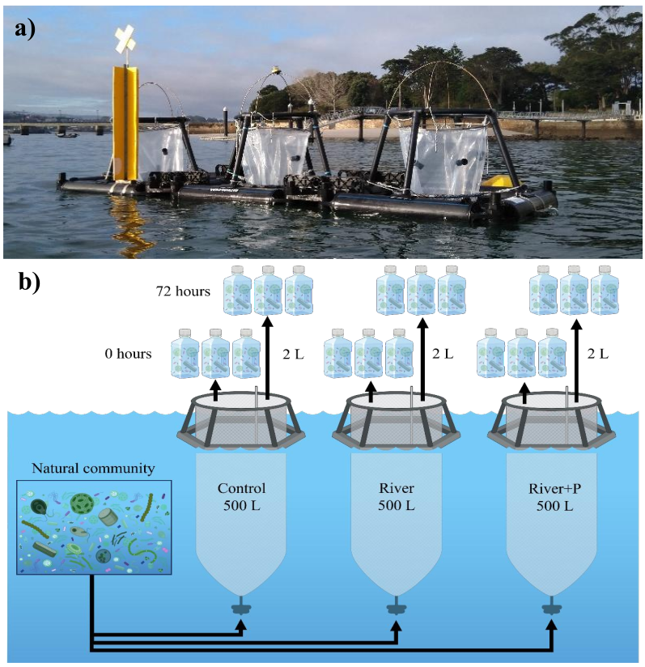

# Dealing with phosphorus deficiency — Metatranscriptomics


Reproducible R workflow for the figures associated with the study:

**“Dealing with phosphorus deficiency: contrasting strategies in marine phytoplankton and bacteria.”**

This repository contains the **paper-ready datasets and analysis code required to reproduce the final figures** of the study. It focuses on the downstream analysis and visualization workflow rather than the computationally intensive upstream processing of the metatranscriptomic data.

## Publication

Delgadillo-Nuño E., Teira E., Fernández E., Justel-Díez M., Di Leo D., Lundin D., Pinhassi J. & Martínez-García S. (2026).  
*Dealing with phosphorus deficiency: contrasting strategies in marine phytoplankton and bacteria.*  
**ISME Communications**, 6(1), ycag035.

**DOI:** https://doi.org/10.1093/ismeco/ycag035

Raw sequencing data are available through the European Nucleotide Archive (ENA):

- Study: `PRJEB94162`
- Samples: `ERS25306826–ERS25306860`
- Reads: `ERR15316847–ERR15316881`

## Overview

The study investigates contrasting responses of marine phytoplankton and heterotrophic bacteria to phosphorus deficiency using metatranscriptomic data from nutrient-manipulation experiments.

The workflow integrates:

- environmental and biological measurements;
- prokaryotic and eukaryotic taxonomic composition;
- nMDS ordination and PERMANOVA results;
- phosphorus-related functional responses;
- differential gene expression results;
- taxonomic contributions to phosphorus-related functions;
- correlations between transcriptional responses and environmental variables.

The repository intentionally starts from compact, **analysis-ready derived datasets**. Raw count processing, taxonomic and functional annotation, TPM calculation, filtering, and differential-expression modelling are considered upstream processing and are not repeated here.

## Experimental design



Schematic overview of the microcosm experiment and metatranscriptomic sampling strategy used in the study.


## Repository structure

```text
dealing-with-p-metat/
├── analysis/
│   └── paper_figures.R
│
├── data/
│   ├── README.md
│   └── derived/
│       ├── figure_1_environmental.csv
│       ├── figure_1_map.png
│       ├── figure_2_nmds_scores.csv
│       ├── figure_2_permanova.csv
│       ├── figure_2_taxonomic_composition.csv
│       ├── figure_3_taxonomic_contributions.csv
│       ├── figure_3_totals.csv
│       ├── figure_4_prokaryote_dge.parquet
│       ├── figure_5_eukaryote_dge.parquet
│       ├── figure_6_correlations.csv
│       ├── supplementary_figure_1_proportions.csv
│       ├── supplementary_figure_2_dge_overview.parquet
│       └── SHA256SUMS
│
├── results/
│   └── figures/
│
└── README.md
```

`data/README.md` documents the provenance and role of each derived dataset.  
`data/derived/SHA256SUMS` provides checksums for the committed data snapshot.

## Reproducing the figures

Clone the repository and run the analysis from the repository root:

```bash
git clone https://github.com/erickdelgadillo/dealing-with-p-metat.git
cd dealing-with-p-metat

Rscript --vanilla analysis/paper_figures.R
```

The workflow reads the datasets stored in `data/derived/` and generates the publication figures in:

```text
results/figures/
```

The script reproduces:

- Figures 1–6
- Supplementary Figures 1–2

No external data paths, saved R workspaces, or raw sequencing files are required.

## R dependencies

The workflow uses the following R packages:

```text
arrow
cowplot
dplyr
ggh4x
ggplot2
magick
patchwork
readr
scales
```

## Data strategy

Large raw and intermediate metatranscriptomic datasets are deliberately excluded from the repository.

Instead, the repository stores only the compact derived datasets required for the published analyses and figures:

```text
Raw sequencing data
        ↓
Upstream processing
        ↓
Paper-ready derived datasets
        ↓
analysis/paper_figures.R
        ↓
Publication figures
```

This design keeps the repository lightweight while preserving the reproducibility of the downstream analyses presented in the publication.

Raw sequencing reads remain publicly available through ENA under accession `PRJEB94162`.

## Data integrity

Checksums for all committed derived datasets are provided in:

```text
data/derived/SHA256SUMS
```

They can be verified with:

```bash
sha256sum -c data/derived/SHA256SUMS
```

## Outputs

The workflow generates the final figures under:

```text
results/figures/
```

These outputs cover environmental conditions, microbial taxonomic composition, multivariate community patterns, phosphorus-related transcriptional responses, differential gene expression, and environmental correlations.

## Citation

If you use this workflow or the associated data, please cite:

> Delgadillo-Nuño E., Teira E., Fernández E., Justel-Díez M., Di Leo D., Lundin D., Pinhassi J. & Martínez-García S. (2026). Dealing with phosphorus deficiency: contrasting strategies in marine phytoplankton and bacteria. *ISME Communications*, 6(1), ycag035. https://doi.org/10.1093/ismeco/ycag035
